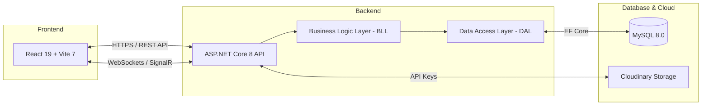

# ShuttleUp - Hệ Thống Kỹ Thuật (Technical Stack)

> Tài liệu tham chiếu chính thức – cập nhật theo thực tế triển khai (Tháng 4/2026).

---

## 1. Tổng Quan Kiến Trúc

Hệ thống được xây dựng theo mô hình **Decoupled Architecture** (Frontend và Backend tách biệt), giao tiếp qua REST API và SignalR cho các tính năng thời gian thực.

---

## 2. Chi Tiết Công Nghệ

### 2.1 Frontend
Dựa trên nền tảng React hiện đại, tối ưu cho tốc độ và trải nghiệm người dùng SaaS.

| Thành phần | Công nghệ | Lưu ý |
|------------|-----------|-------|
| **Core Framework** | React 19.x | Sử dụng Functional Components & Hooks |
| **Build Tool** | Vite 7.x | Cấu hình cho Hot Module Replacement (HMR) cực nhanh |
| **Routing** | React Router 7.x | Hỗ trợ Nested Routes, Protected Routes |
| **State Management** | Context API / Local State | Quản lý Auth, Notifications, Booking Context |
| **Styling** | Bootstrap 5.3 + Tailwind CSS 4 | Phối hợp Utility-first CSS và Components |
| **Real-time** | @microsoft/signalr | Nhận thông báo và chat không cần reload |
| **Maps** | Leaflet + React Leaflet | Hiển thị vị trí sân, bản đồ tìm kiếm |
| **UI Components** | Swiper, AOS, Lightbox | Hiệu ứng mượt mà cho slider và ảnh |

### 2.2 Backend
Kiến trúc 3 lớp (3-Layer Architecture) đảm bảo tính mở rộng và dễ bảo trì.

| Thành phần | Công nghệ | Tác dụng |
|------------|-----------|----------|
| **Core Platform** | .NET 8 (ASP.NET Core 8) | Hiệu năng cao, đa nền tảng |
| **Web API** | ASP.NET Core Web API | RESTful standards |
| **Real-time Hub** | SignalR | Xử lý thông báo (Notification) và Chat |
| **Logic Layer** | ShuttleUp.BLL | Xử lý nghiệp vụ, Validation nâng cao |
| **Data Layer** | ShuttleUp.DAL | Abstraction cho Database qua EF Core |
| **Documentation** | Swagger / OpenAPI | Tự động sinh tài liệu API |

### 2.3 Database & Storage
Dữ liệu quan hệ được chuẩn hóa và lưu trữ tệp tin trên nền tảng đám mây.

| Thành phần | Công nghệ | Mô tả |
|------------|-----------|-------|
| **Database** | **MySQL 8.0** | Lưu trữ người dùng, sân, đặt chỗ, giao dịch |
| **ORM** | Entity Framework Core | Mapping dữ liệu (Snake Case naming convention) |
| **Image Hosting** | Cloudinary | Lưu trữ ảnh Sân (Venue), Profile, Minh chứng CK |
| **Schema Source** | `Database.txt` | Single Source of Truth cho cấu trúc CSDL |

### 2.4 Bảo Mật & Xác Thực

- **Authentication**: JWT (JSON Web Token) cho các request API.
- **Password Security**: Mã hóa bằng **Bcrypt**.
- **Authorization**: Role-Based Access Control (RBAC) cho 3 nhóm: `ADMIN`, `MANAGER`, `PLAYER`.
- **Social Auth**: Tích hợp Google OAuth (@react-oauth/google).

---

## 3. Hệ Thống Icons & Typography

Dự án áp dụng quy tắc nghiêm ngặt về font và icon để tránh lỗi hiển thị tiếng Việt:

- **Typography**: Font **"Be Vietnam Pro"** (Google Font) – chuẩn diacritics Việt Nam.
- **Icons Manager/Admin**: **Feather Icons** (Lightweight, chuyên nghiệp).
- **Icons Player**: **FontAwesome 7** (Load qua file tĩnh để tránh xung đột Vite bundle).

---

## 4. Tích Hợp Bên Ngoài (Third-party)

1.  **VietQR (Napas)**: Tự động tạo mã QR thanh toán theo chuẩn ngân hàng Việt Nam.
2.  **Notification Hub**: SignalR thông báo real-time khi có booking mới, refund, hoặc tin nhắn.
3.  **Bank Lookup**: API VietQR để xác minh số tài khoản/ngân hàng của Chủ sân.

---

*Cập nhật lần cuối: 10/04/2026 bởi Antigravity AI.*
