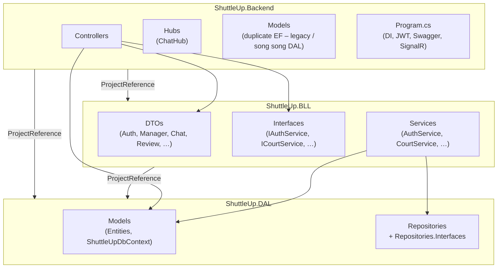

# ShuttleUp – Backend package diagram

Sơ đồ phụ thuộc giữa các **project** (.csproj) và **namespace** chính trong solution.

## Project references

| Project | References |
|---------|------------|
| `ShuttleUp.DAL` | — |
| `ShuttleUp.BLL` | `ShuttleUp.DAL` |
| `ShuttleUp.Backend` | `ShuttleUp.BLL`, `ShuttleUp.DAL` |

> Một số controller inject trực tiếp `ShuttleUpDbContext` / entity từ DAL nên Backend tham chiếu cả BLL và DAL.

## Mermaid (xem preview trên GitHub / VS Code)

## PlantUML

File tương ứng: [`backend-package-diagram.puml`](./backend-package-diagram.puml) (mở bằng extension PlantUML hoặc render online).
