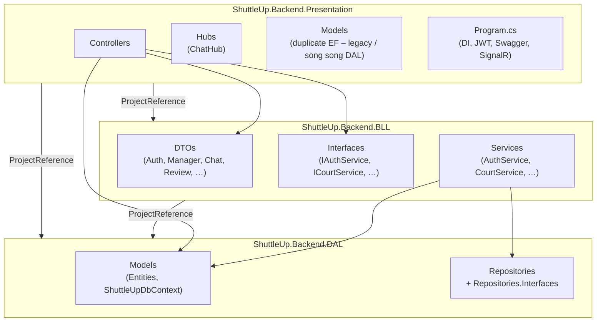

# ShuttleUp – Backend package diagram (Mermaid)

File **chỉ code Mermaid**: [`backend-package-diagram.mmd`](./backend-package-diagram.mmd) — mở [mermaid.live](https://mermaid.live) và dán nội dung file.

## Project references

| Project | References |
|---------|------------|
| `ShuttleUp.Backend.DAL` | — |
| `ShuttleUp.Backend.BLL` | `ShuttleUp.Backend.DAL` |
| `ShuttleUp.Backend.Presentation` | `ShuttleUp.Backend.BLL`, `ShuttleUp.Backend.DAL` |

> Backend tham chiếu DAL vì một số controller dùng trực tiếp `ShuttleUpDbContext` / entity.

## Mermaid (render trên GitHub)

```mermaid
flowchart TB
  subgraph DAL["ShuttleUp.Backend.DAL"]
    DAL_Models["Models\n(Entities, ShuttleUpDbContext)"]
    DAL_Repo["Repositories\n+ Repositories.Interfaces"]
  end

  subgraph BLL["ShuttleUp.Backend.BLL"]
    BLL_DTO["DTOs\n(Auth, Manager, Chat, Review, …)"]
    BLL_Int["Interfaces\n(IAuthService, ICourtService, …)"]
    BLL_Svc["Services\n(AuthService, CourtService, …)"]
  end

  subgraph BE["ShuttleUp.Backend.Presentation"]
    BE_Ctrl["Controllers"]
    BE_Hub["Hubs\n(ChatHub)"]
    BE_Models["Models\n(duplicate EF – legacy / song song DAL)"]
    BE_Prog["Program.cs\n(DI, JWT, Swagger, SignalR)"]
  end

  BLL -->|ProjectReference| DAL
  BE -->|ProjectReference| BLL
  BE -->|ProjectReference| DAL

  BLL_Svc --> DAL_Repo
  BLL_Svc --> DAL_Models
  BE_Ctrl --> BLL_Int
  BE_Ctrl --> BLL_DTO
  BE_Ctrl --> DAL_Models
```
